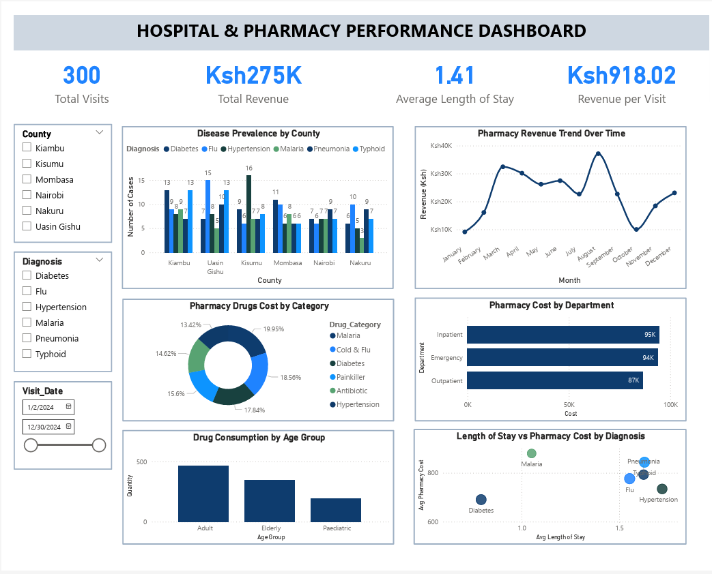

# Hospital & Pharmacy Performance Dashboard



A healthcare business intelligence project analysing patient visits, pharmacy revenue, disease patterns, departmental performance, county-level variation, age-group medication spending, and operational efficiency using Power BI and Excel.

## Project Overview

This project analyses **300 patient visits across six counties** during 2024 to identify patterns in hospital activity, diagnoses, pharmacy revenue, medication demand, and operational performance.

The analysis generated **KES 275,407 in pharmacy revenue**, with an average pharmacy revenue of **KES 918 per visit** and an average length of stay of **1.41 days**.

The project combines structured data analysis with interactive Power BI dashboards and supporting Excel analysis to communicate operational and strategic insights.

## Business Objectives

The analysis was designed to answer questions such as:

- How does patient activity vary across counties?
- Which diagnoses are most common?
- Which diagnoses generate the highest pharmacy revenue?
- Does a higher number of visits necessarily result in higher pharmacy revenue?
- How do Inpatient, Emergency, and Outpatient departments compare?
- Which age groups account for the highest pharmacy spending?
- How does length of stay relate to pharmacy revenue?
- Which medication categories contribute most to pharmacy revenue?
- Where are there opportunities to improve operational efficiency?

## Key Performance Indicators

| KPI | Result |
|---|---:|
| Patient Visits | 300 |
| Counties Analysed | 6 |
| Pharmacy Revenue | KES 275,407 |
| Average Revenue per Visit | KES 918 |
| Average Length of Stay | 1.41 days |

## Disease & County Analysis

Disease prevalence varies across counties.

Across the dataset:

- **Flu** was the most common diagnosis with 56 cases.
- **Typhoid** followed with 54 cases.
- **Diabetes** accounted for 53 cases.

County-specific patterns were also identified.

Examples include:

- Kisumu recorded 16 hypertension cases.
- Uasin Gishu recorded 15 Flu cases.
- Nakuru recorded 10 Flu cases.
- Kiambu recorded 13 Flu cases.

The analysis demonstrates the importance of looking beyond overall disease totals and considering geographical variation when planning interventions.

## Visits vs Pharmacy Revenue

One of the key findings was that **higher visit volume does not automatically produce higher pharmacy revenue**.

For example:

| County | Pharmacy Revenue per Visit |
|---|---:|
| Uasin Gishu | KES 1,197 |
| Nakuru | KES 750 |

This represents approximately a **60% difference in revenue per visit** despite similar visit volumes.

The analysis associated this difference with the mix of diagnoses rather than patient volume alone.

High-revenue diagnoses included:

- Typhoid — KES 1,141 per visit
- Malaria — KES 1,105 per visit

Lower-revenue diagnoses included:

- Diabetes — KES 704 per visit
- Flu — KES 735 per visit

## Departmental Performance

The analysis compared three hospital departments:

- Inpatient
- Emergency
- Outpatient

Revenue contribution was relatively balanced across the three departments, with each contributing approximately one-third of total pharmacy income.

Emergency recorded the highest pharmacy revenue efficiency at approximately:

**KES 930 per visit**

This creates an opportunity to investigate whether medication protocols, patient case complexity, or service processes contributing to this efficiency could be adapted elsewhere.

## Age-Group Medication Patterns

Age-group analysis identified a strong concentration of pharmacy spending among older patients.

The **66+ age group accounted for 36.6% of total pharmacy costs**, despite representing a smaller share of visits.

The analysis associated this higher per-visit cost with chronic disease management.

The 36–50 age group showed comparatively low medication consumption, creating a potential area for further investigation into preventive-care engagement.

## Operational Efficiency

The relationship between length of stay and pharmacy revenue revealed several areas for operational review.

### Diabetes

- Average stay: **0.79 days**
- Average pharmacy revenue: **KES 704 per visit**

This combination suggests relatively efficient management with short stays and lower medication costs.

### Flu

- Average stay: **1.55 days**
- Average pharmacy revenue: **KES 735 per visit**

The longer stay combined with relatively low pharmacy spending raises questions about patient flow and discharge efficiency.

### Hypertension

- Average stay: **1.72 days**

The longest observed average stay among the highlighted diagnoses suggests an opportunity to review treatment and operational protocols.

## Medication Revenue

The major medication categories generated substantial pharmacy revenue.

Top categories included:

| Medication Category | Revenue |
|---|---:|
| Malaria medications | KES 54,950 |
| Cold & Flu | KES 51,117 |
| Diabetes treatments | KES 49,141 |

These results provide a basis for aligning pharmacy inventory and operational planning with medication demand.

## Strategic Recommendations

The analysis identified several potential actions:

### 1. County-Specific Disease Planning

Use county-level disease patterns to inform targeted prevention and intervention programmes.

### 2. Diagnose Revenue Drivers

Focus not only on visit volume but also on diagnosis mix when evaluating pharmacy revenue performance.

### 3. Strengthen Geriatric Medication Management

Develop medication review and polypharmacy-prevention approaches for the 66+ population.

### 4. Review Patient Flow

Investigate diagnoses associated with longer stays but relatively low pharmacy spending to identify opportunities for more efficient patient flow and discharge processes.

### 5. Align Pharmacy Inventory With Demand

Use medication-category revenue patterns to support inventory planning and prioritisation.

## Dashboard Views

The project includes multiple analytical views.

### County Dashboards

County-specific dashboards are available for:

- Kiambu
- Kisumu
- Mombasa
- Nairobi
- Nakuru
- Uasin Gishu

### Diagnosis Dashboards

Diagnosis-specific dashboards are available for:

- Diabetes
- Flu
- Hypertension
- Malaria
- Pneumonia
- Typhoid

## Project Files

```text
hospital-pharmacy-performance-dashboard/
│
├── dashboard.png
├── executive_insights_summary.txt
├── hospital_pharmacy_data.xlsx
├── hospital_pharmacy_performance_dashboard.pbix
├── hospital_pharmacy_performance_report.pdf
│
├── County_Dashboards/
│   ├── kiambu-county-dashboard.pdf
│   ├── kisumu-county-dashboard.pdf
│   ├── mombasa-county-dashboard.pdf
│   ├── nairobi-county-dashboard.pdf
│   ├── nakuru-county-dashboard.pdf
│   └── uasin-gishu-county-dashboard.pdf
│
└── Diagnosis_Dashboards/
    ├── diabetes-dashboard.pdf
    ├── flu-dashboard.pdf
    ├── hypertension-dashboard.pdf
    ├── malaria-dashboard.pdf
    ├── pneumonia-dashboard.pdf
    └── typhoid-dashboard.pdf
```

## Tools & Technologies

- Microsoft Power BI
- Microsoft Excel
- Data Analysis
- Data Visualization
- Business Intelligence
- Dashboard Development
- Healthcare Analytics
- KPI Analysis
- Executive Reporting
- Git & GitHub

## Skills Demonstrated

- Healthcare data analysis
- Business intelligence
- KPI development
- Dashboard design
- Comparative analysis
- Revenue analysis
- Disease pattern analysis
- Geographic analysis
- Operational performance analysis
- Insight generation
- Executive reporting
- Data-driven recommendation development

## Project Context

**Training Project — LuxDev Data Analytics Program**

This project was completed as part of practical data analytics and business intelligence training, with a focus on translating healthcare operational data into actionable insights.

## Author

**Jason Ndalamia**

Data Analytics | Business Intelligence | AI & Technology

[GitHub](https://github.com/JNdalamia)