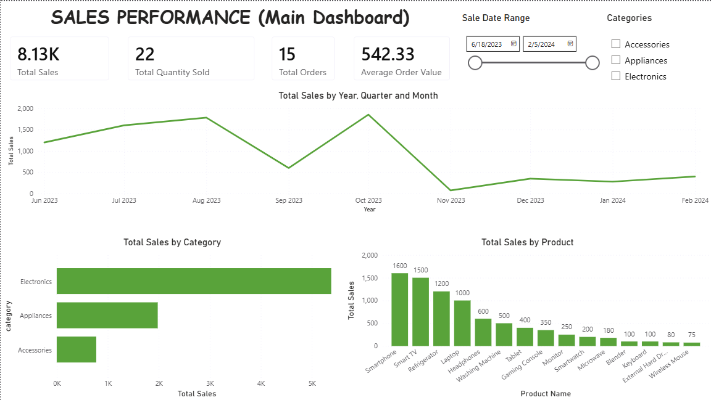

# SQL & Power BI Business Intelligence Dashboard



A business intelligence project combining SQL, Power BI, DAX, and Power Query to analyse sales performance, product performance, customer behaviour, and inventory status.

## Project Overview

This project demonstrates an end-to-end business intelligence workflow using a relational retail dataset.

The analysis focuses on four areas:

- Sales performance
- Product performance
- Customer behaviour
- Inventory management

The project combines SQL analysis with an interactive Power BI dashboard designed to communicate business insights clearly.

## Business Objectives

The analysis was designed to answer questions such as:

- How are sales performing over time?
- Which products and categories generate the most revenue?
- Which customers are the highest-value customers?
- How does customer membership relate to purchasing behaviour?
- Which products have low inventory levels?
- How can sales performance and inventory information support business decisions?

## Dataset

The project uses four related tables:

| Table | Description |
|---|---|
| `customers` | Customer demographic and membership information |
| `products` | Product catalogue, pricing, category and supplier information |
| `sales` | Transaction-level sales records |
| `inventory` | Current stock levels by product |

## Data Model

The Power BI model uses a relational structure with `sales` as the central transaction table.

Key relationships include:

```text
customers  ───<  sales  >───  products
                              │
                              │
                          inventory
```

Relationships:

- `sales.customer_id` → `customers.customer_id`
- `sales.product_id` → `products.product_id`
- `inventory.product_id` → `products.product_id`

## Dashboard Analysis

### 1. Sales Performance

The dashboard provides an overview of sales performance using:

- Total Sales
- Total Quantity Sold
- Average Order Value
- Sales trends over time
- Revenue comparisons

### 2. Product Performance

The product analysis identifies:

- Highest-revenue products
- Product category performance
- Revenue concentration
- Top-performing products

### 3. Customer Insights

Customer analysis focuses on:

- Membership tiers
- Customer spending behaviour
- Highest-value customers
- Customer segmentation

### 4. Inventory Management

Inventory analysis provides visibility into:

- Current stock levels
- Products with low stock
- Inventory position relative to sales activity

## Key DAX Measures

Examples of measures used in the dashboard include:

```DAX
Total Sales =
SUM(sales[total_amount])
```

```DAX
Total Qty =
SUM(sales[quantity_sold])
```

```DAX
AOV =
DIVIDE(
    [Total Sales],
    COUNT(sales[sale_id])
)
```

These measures support KPI cards and analytical visuals throughout the dashboard.

## Tools & Technologies

- PostgreSQL
- SQL
- Power BI Desktop
- DAX
- Power Query
- Data Modelling
- Data Visualization
- Git & GitHub

## Project Files

```text
sql-power-bi-business-intelligence/
│
├── dashboard.png
├── sql_power_bi_dashboard.pbix
└── README.md
```

## How to Use

1. Install Power BI Desktop.
2. Download or clone this repository.
3. Open `sql_power_bi_dashboard.pbix`.
4. Review the report pages and interactive visuals.
5. To refresh the underlying data, configure the appropriate SQL data source in Power BI.

## Skills Demonstrated

This project demonstrates practical skills in:

- SQL data analysis
- Relational data modelling
- Business intelligence
- Power BI dashboard development
- DAX calculations
- Power Query
- KPI development
- Data visualization
- Business-oriented analytical thinking
- Git and GitHub

## Project Context

**Training Project — LuxDev Data Analytics Program**

This project was completed as part of practical data analytics and business intelligence training, with a focus on applying technical skills to a realistic retail business scenario.

## Author

**Jason Ndalamia**

Data Analytics | Business Intelligence | AI & Technology

[GitHub](https://github.com/JNdalamia)
